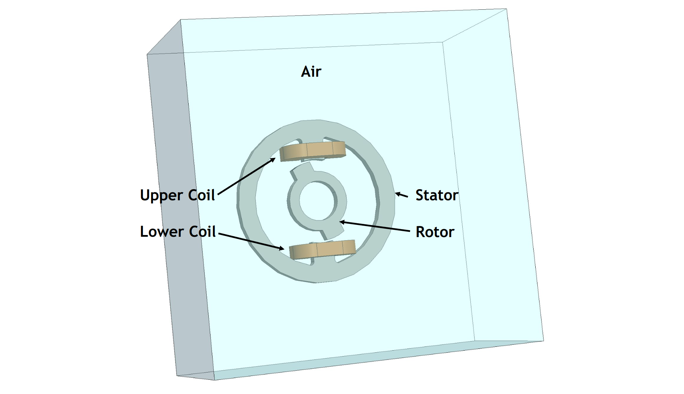
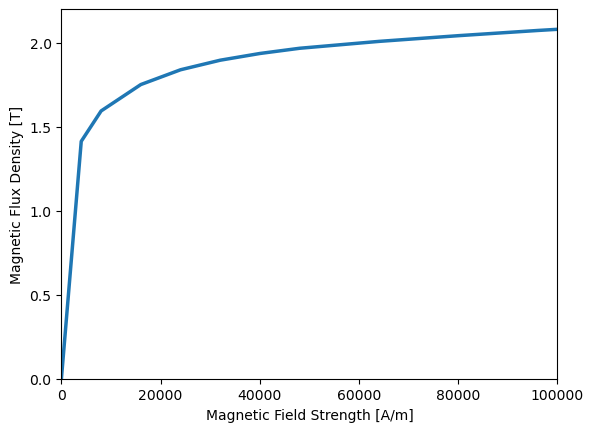
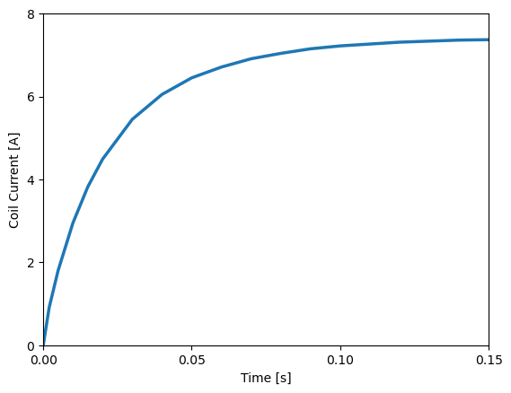
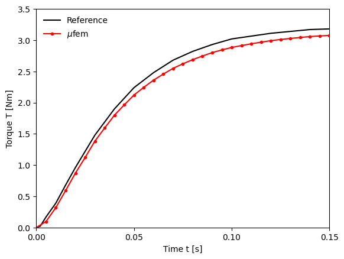

# Compumag TEAM-24: Nonlinear Time-Transient Rotational Test Rig

The benchmark case [1] is a transient magnetic problem involving eddy currents and nonlinear materials, solved using [case.py](case.py). The geometry consists of a rotor locked at 22°, a stator, and two coils surrounded by an air domain, as shown:  


The [mesh](geometry.mesh) was created using Netgen, with the mesh file exported to MFEM v1.3.

## Setup

The *rotor* and *stator* are made of iron material with a constant electrical conductivity of 
$\sigma = 4.54 	\times 10^6$ and a B-H curve. However, as pointed out by [2], the provided [B-H curve](tables/Table_1_BH_curve.csv) lacks sufficient data between zero and the first data point, leading to significant errors. To address this issue, the modified Fröhlich formula is used to fit the data (the modification ensures physical behavior [3]). The modified Fröhlich formula is given by:

$$
B(H) = \frac{1}{a + b H} + \mu_0 H \quad,
$$

where \(a\) and \(b\) are fitting parameters. We calculate these parameters based on the complete curve and use them to interpolate the initial part.

| [Original B-H Curve](tables/Table_1_BH_curve.csv) | [Modified B-H Curve](tables/Updated_BH_curve.csv) |
| ----------------- | ------------------------------- |
|  |  |

For the coils, a time-dependent electric current is prescribed from a [CSV file](tables/Table_3_Coil_Current.csv) on both stranded (wound) coils, starting at \(I = 0\ \mathrm{A}\) and rising to the steady-state value of \(I = 7.41\ \mathrm{A}\), as shown here:



Finally, we create a `MagneticTorqueReport` to measure the magnetic torque on the locked rotor over time and compare it with the reference.

The simulation is run with:
```bash
> pymufem case.py
...
174 1.130105e-11
ReportMonitor: Rotor Torque Monitor : [0.026124448259359362, -0.002966364046512432, 1.320018800598565]
Time: 0.14500000000000005 of 0.15 with Δt=0.005 
175 2.676986e-07
electromagnetic.TimeDomainMagneticModel, 
176 3.036165e-11
177 1.210335e-11
178 1.184276e-11
179 1.172570e-11
180 1.173960e-11
ReportMonitor: Rotor Torque Monitor : [0.02618167920146705, -0.002974783431187636, 1.323128413798604]
Time: 0.15000000000000005 of 0.15 with Δt=0.005 
Simulation done. Thank you for using the software.
```

## Results

The script [case.py](case.py) includes a subsequent analysis section that extracts the torque vs. time data and creates a plot to compare with the reference:



The torque is reasonably well reproduced in the simulation. Some mesh convergence study would clarify the remaining offset. Unfortunately, given that the bh curve needs to be modify a cross-comparison is somewhat limited as long as the used bh curve is not shared.

## References

[1] https://www.compumag.org/wp/wp-content/uploads/2018/06/problem24.pdf  

[2] Rüberg, T., Kielhorn, L., and Zechner, J., 2021. Electromagnetic devices with moving parts—simulation with FEM/BEM coupling. *Mathematics*, 9(15), p.1804.  

[3] Diez, P., and Webb, J.P., 2015. A Rational Approach to \( B \)–\( H \) Curve Representation. *IEEE Transactions on Magnetics*, 52(3), pp.1-4.  